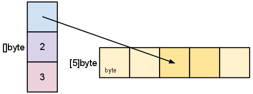

**切片** (*Slice*)，是一种十分常用的数据结构，它几乎是每一种编程语言的核心，集中体现了语言本身的设计理念。这一部分在切片基础概念的基础上深入探讨一下关于 Golang 中切片的**基本用法**、**底层实现**和**注意事项**，并不会太涉及基本的语法。

## 基本使用

首先应该了解，切片是作为固定大小的数组的指针的形式存在的，它是一种**新的数据结构**，描述了固定大小的数组的一部分，而不是数据，不应该把数组的切片与数组本身混淆起来。

切片的索引是一个半开区间，在 Go 中，不允许负索引和逆索引的存在。

对于切片的属性，需要知道它拥有**长度** (*len*)和**容量 **(*cap*)，长度是切片**包含指向的**元素的个数，容量是它从指向的第一个元素开始，到**底层数组末尾**元素的个数。

可以使用对应的函数对切片执行追加、遍历等操作。

## 底层实现

### 长度和容量的关系

下图是切片的底层数据结构，其中 ptr 是一个**指向数组某一位置**的**指针**。

一个长度为 5 的 byte 数组的切片 s 是这样的：

而如果将切片更新：s = s[2:4]，就变成了这样：

由于不允许存在负索引，所以，数组的前两个元素就再无法通过切片访问到了，此时切片的容量从 5 缩小为 3。

所以，**容量其实是代表了长度的最大限制**。

### 切片的生长

append 函数会将传入的元素放入切片所指向底层数组的最后，并在必要时增长数组的长度，切片的容量也随之增加。但是，append 函数返回的切片并**不是原来切片的副本**，这就保证了操作切片具有与操作底层数组相同的性能。需要注意的是，append 进行的内存扩容遵循对于不同数据类型遵循稍微有所不同的规则，但是通常是会在第一次 append 元素数量的基础上进行乘以 2 运算， 当达到一定大小时 append 会将源数据深拷贝到新的内存地址。

【待补充：实例测试】

具体的规则可以大致概括为 (但是还是需要具体情况具体分析)：

-   当需要的容量超过原切片容量的两倍时，会使用需要的容量作为新容量。
-   当原切片长度小于1024时，新切片的容量会直接翻倍。而当原切片的容量大于等于1024时，会反复地增加25%，直到新容量超过所需要的容量。

copy 函数可以完成切片到切片的数据拷贝，只会拷贝较少长度的那些数据，会覆盖掉原来位置的数据。

请谨慎地使用 append 和 copy，因为频繁的内存复制和扩充会对 GC 的性能产生影响，且由于 GC 大多数情况下在退出一个作用域时才会清理未使用的内存，以 copy 为例，原副本的空间在 copy 之后而未退出作用域以前都被浪费掉了。

## 注意事项

切片虽然在保证灵活性的同时没有丢失掉数组原有的高性能，但是也存在着一些可能的 “**陷阱**”。

-   由于切片仅是底层数组的引用，对于切片的操作并不会复制底层的数组。因此，当一个切片指向了一个容量为 1W 的数组，却只需要使用长度为 10 的数组数据时，整个数组依然需要一直保存在内存中，直到数组不被切片所引用。

    也就是说，**一个小的内存引用却导致保存了所有的数据**。

    要解决这个问题，可以**将需要使用的数据复制到一个新的切片中**。

-   另外，几乎是同样的原因，如果创建了多个对于同一个数组的切片，由于这些切片都指向同一个数组，那么通过任意一个切片对底层数据的修改，均会影响到所有其它切片，尤其是在函数调用这种程序容易发生未知行为的情况。

    同样的，解决方法也是在定义新的切片时**复制需要使用的数据**。比如，在递归调用函数，且需要向其中传入切片时，如递归函数需要对切片指向的数据进行修改，那么**务必传入切片的深拷贝**，以防止程序出现异常行为。

-   创建二维切片时有两种方式。一种是为每一维单独使用 make 函数创建切片；另一种是直接使用 make 创建足够大小的一个切片，而对于每一维则直接对这个大型切片进行切片。第一种方式需要频繁的调用 make 函数，而第二种方式则要求当前虚拟内存需要存在满足要求容量的一大段连续内存，使用哪一种方式，这要看个人的选择。

-   由于扩容机制会预先多扩容一些空间，因此在实际编程中会遇到一些异常情况，如通过 cap() 来扩展切片时，如果恰巧切片进行了扩容，那么此时扩展后的切片尾部就会多出很多空数据，且 len() 也会与预想的不一致。

除了，需要注意的一些陷阱，切片作为一种非常常用的数据结构，对于切片，不同的编程习惯对程序执行的性能影响是十分深远且重要的，请务必**尽量减少 `copy` 和 `append` 的使用**，如：

-   如果**已知需要使用数组大小的情况**下，请**直接申请对应大小的数组**，**使用索引来访问和修改数据**，而不是使用 append。
-   如果需要拷贝一个切片，且在拷贝后需要 append 一个元素，或是一个切片，那么请尽量**先直接创建对应大小的切片再 `copy`**，而不是先 copy 再 append。

