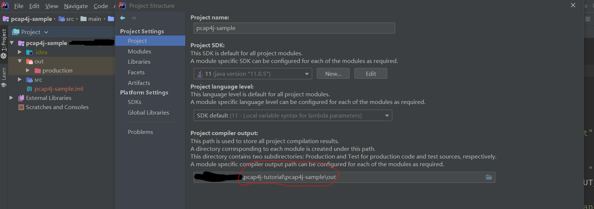
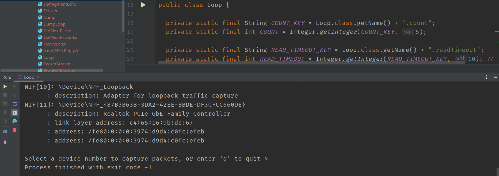

目录（Content）
----------

* [3W](#3W)
    * [What](#What)
    * [Why](#Why)
    * [How](#How)

* [安装及配置 Pcap](#安装及配置Pcap)
    * [下载](#下载)
    * [安装](#安装)
    * [配置 NPcap 环境变量](#配置NPcap环境变量)
* [初始化项目](#初始化项目)
    * [克隆](#克隆)
    * [打开项目](#打开项目)
    * [配置 out 路径](#配置out路径)
    * [配置库依赖](#配置库依赖)
    * [配置项目结构](#配置项目结构)
    * [测试](#测试)

****

3W
----------

### What

引用[官网](https://www.pcap4j.org/)的一段介绍

> Pcap4J is a Java library for capturing, crafting and sending packets. Pcap4J wraps a native packet capture library ([libpcap](http://www.tcpdump.org/), [WinPcap](http://www.winpcap.org/), or [Npcap](https://github.com/nmap/npcap)) via [JNA](https://github.com/twall/jna) and provides you Java-Oriented APIs.

**所以，可以这样看待 Pcap4J（以下内容均简称为 p4)**

- **p4** 类似于 Java 的 JPcap、JNetPcap、JxNet 等库，**基于 [JNA](https://github.com/twall/jna) 实现**，提供了捕获、拦截以及发送**最底层数据包（数据链路层）**的 **API**。

- **p4** 本质上是一个**中间件**，**通过 JNA 调用 WinPcap 或 LibPcap 的函数**，为 Java 语言实现网络抓包提供了一个公共的接口。

- 由于 Java 的平台无关性，因此使用 **p4**  接口开发的应用程序也是**平台无关的**。

### Why

使用 **p4** 主要原因有以下几个

- JPcap 及 JNetPcap 库虽然使用者多，但是年久失修

- JxNet 库过于小众

- **p4** 一直处于开发及维护的状态，作者还一直在进行 **2.0 版本的开发**（本仓库的所有内容都基于 2.0 版本）

- **p4** 对于协议进行更加全面的封装，支持的协议列表如下：

    > - Ethernet, Linux SLL, raw IP, PPP (RFC1661, RFC1662), BSD (Mac OS X) loopback encapsulation, and Radiotap
    > - IEEE 802.11
    >     - Probe Request
    > - LLC and SNAP
    > - IEEE802.1Q
    > - ARP
    > - IPv4 (RFC791 and RFC1349) and IPv6 (RFC2460)
    > - ICMPv4 (RFC792) and ICMPv6 (RFC4443, RFC4861, and RFC6275)
    > - TCP (RFC793, RFC2018, and draft-ietf-tcpm-1323bis-21), UDP, and SCTP (only common header)
    > - GTPv1 (only GTP-U and GTP-C header)
    > - DNS (RFC1035, RFC3596, and RFC6844)

    **2.0 版本还添加了对 http 等协议的支持**

### How

关于如何使用见下文。

安装及配置Pcap
----------

**本文只介绍 Windows + NPcap**，其余的情况比较简单

**NPcap** 由 **NAMP** 开源组织开发，**基于 WinPcap**，[官网](https://nmap.org/npcap/)上将它称为 [**WinPcap for Windows 10**](https://nmap.org/npcap/windows-10.html)

### 下载

https://nmap.org/npcap/dist/npcap-0.9986.exe

也可自行去官网下载

### 安装

下载完成，点击安装即可

### 配置NPcap环境变量

由于 **p4** 默认的扫描目录是

```
C:\Windows\System32
```

而 **NPcap** 的安装目录为

```
C:\Windows\System32\Npcap
```

因此，需要将 **NPcap** 的安装目录加入环境变量 **Path** 中，如图


初始化项目
----------

### 克隆

打开 git bash

```
git clone https://github.com/1uvu/pcap4j-tutorial
```

### 打开项目

使用 **IntelliJ IDEA** 打开 **pcap4j-sample** 文件夹

### 配置out路径

- File -> Project Structure -> Project -> Project compiler output 选择如图路径 -> ok

    

### 配置库依赖

- File -> Project Structure -> Project -> Project SDK 和 Project language level 都选择 11 -> ok

    

- File -> Project Structure -> Libraries -> 加号 -> 选择 pcap4j-lib 文件夹 -> ok -> ok

    

- File -> Project Structure ->  Modules -> Dependencies -> 打上 pcap4j-lib 前面的复选框 -> ok

    

### 配置项目结构

- File -> Project Structure -> Modules -> Sources -> 右键 src/main/java 选择 Sources -> 右键 src/main/resources 选择 Resources 

    

### 测试

运行 Loop，如正常运行则配置完成

